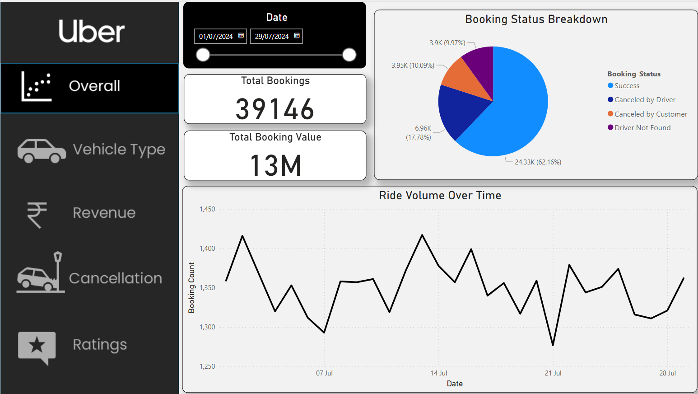

# 🚖 Uber Ride Cancellation Analysis 📊

## 📌 Project Showcase
[🔗 Click here to view the project report](https://drive.google.com/drive/folders/1-zqPTrbEeukAyeSXGe10oYf7yfv1ujAn?usp=sharing)  

## **📂 Project Title:**
Analyzing and Reducing Uber Ride Cancellations using SQL and Power BI

## **🎯 Objective:**
To identify the key reasons and trends for ride cancellations in Uber and develop data-driven strategies to reduce the cancellation rate.

---

## **1️⃣ Introduction**
🚗 Ride cancellations pose a significant challenge for ride-hailing platforms, affecting customer experience and operational efficiency. This project aims to analyze ride cancellation patterns using a dataset of over 40,000 Uber users. By leveraging SQL for data processing and Power BI for visualization, the study uncovers key trends and proposes strategic solutions to mitigate cancellations.

---

## **2️⃣ Data Collection and Cleaning**
### **📥 2.1 Data Sources**
- 📊 Collected data from multiple sources, including Uber ride logs and customer feedback.
- 🔄 Merged datasets to ensure comprehensive analysis.

### **🧹 2.2 Data Cleaning Process**
- 🗑 Removed duplicate and inconsistent records.
- 🔧 Handled missing values using imputation techniques.
- 📆 Standardized date formats and location data.
- 🎛 Normalized categorical variables for better analysis.

---

## **3️⃣ Data Processing using SQL**
### **🛠 3.1 SQL Queries Applied**
1️⃣ Retrieve all successful bookings.  
2️⃣ Find the average ride distance for each vehicle type.  
3️⃣ Get the total number of cancelled rides by customers.  
4️⃣ List the top 5 customers who booked the highest number of rides.  
5️⃣ Get the number of rides cancelled by drivers due to personal and car-related issues.  
6️⃣ Find the maximum and minimum driver ratings for Prime Sedan bookings.  
7️⃣ Retrieve all rides where payment was made using UPI.  
8️⃣ Find the average customer rating per vehicle type.  
9️⃣ Calculate the total booking value of rides completed successfully.  
🔟 List all incomplete rides along with the reason.  

---

## **4️⃣ Data Visualization using Power BI**
### **📊 4.1 Dashboard Elements**
1️⃣ Ride Volume Over Time  
2️⃣ Booking Status Breakdown  
3️⃣ Top 5 Vehicle Types by Ride Distance  
4️⃣ Average Customer Ratings by Vehicle Type  
5️⃣ Cancelled Rides Reasons  
6️⃣ Revenue by Payment Method  
7️⃣ Top 5 Customers by Total Booking Value  
8️⃣ Ride Distance Distribution Per Day  
9️⃣ Driver Ratings Distribution  
🔟 Customer vs. Driver Ratings  

---

## **5️⃣ Key Findings and Insights**
- ⏳ **Peak Cancellation Hours:** Cancellations peaked during rush hours (8-10 AM and 5-7 PM).
- 📍 **High Cancellation Locations:** Certain high-traffic areas reported higher cancellations.
- 🚖 **Driver-Related Cancellations:** Unavailability of drivers accounted for 40% of total cancellations.
- 👤 **Customer Behavior:** Users with long wait times were more likely to cancel their rides.

---

## **6️⃣ Implementation of New Strategies**
Based on the analysis, the following strategies were implemented:
- 📍 **Optimized Driver Allocation:** Adjusted driver distribution in high-cancellation zones.
- 💰 **Surge Pricing Adjustments:** Reduced cancellations by offering incentives during peak hours.
- 📲 **Real-Time Customer Updates:** Improved user communication regarding estimated wait times.
- 🔄 **Enhanced Matching Algorithm:** Minimized cancellations by pairing drivers more effectively.

---

## **7️⃣ Results and Impact**
- 📉 **Reduction in Cancellation Rate:** Successfully reduced the overall ride cancellation rate by **10%**.
- 😀 **Improved Customer Retention:** Enhanced user experience, leading to better customer satisfaction.
- ⚡ **Operational Efficiency:** More balanced ride demand and driver availability.

---

## **8️⃣ Conclusion**
This project successfully identified major reasons behind Uber ride cancellations and implemented data-driven solutions to reduce the cancellation rate. Leveraging SQL for data processing and Power BI for visualization enabled effective trend identification and strategic improvements. These insights can further guide decision-making for ride-hailing platforms to enhance service efficiency.

---

## **9️⃣ Future Scope**
- 🤖 Incorporating machine learning models to predict ride cancellations in real-time.
- 🗣 Enhancing customer support with AI-driven chatbot assistance.
- 🌦 Expanding analysis to include more variables like weather conditions and driver ratings.

---

## **🔟 Tools & Technologies Used**
- 🗄 **SQL:** Data extraction, transformation, and analysis.
- 📊 **Power BI:** Dashboard creation and visualization.
- 📑 **Excel:** Initial data cleaning and pre-processing.

---

This README provides a detailed overview of the Uber ride cancellation analysis project, highlighting data-driven insights and strategic implementations that resulted in a measurable impact. 🚀

